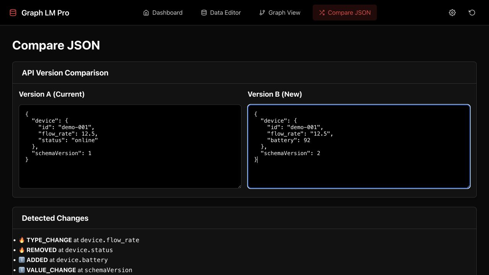
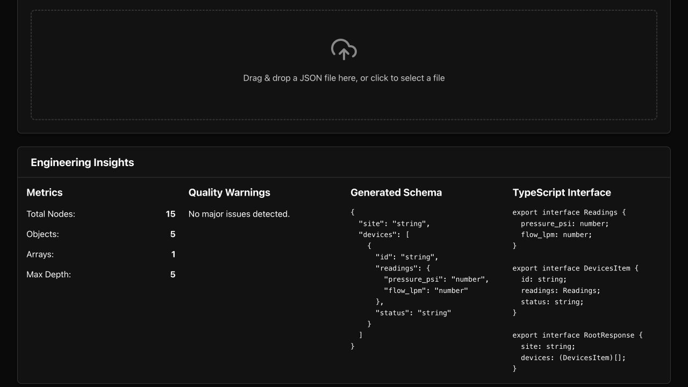
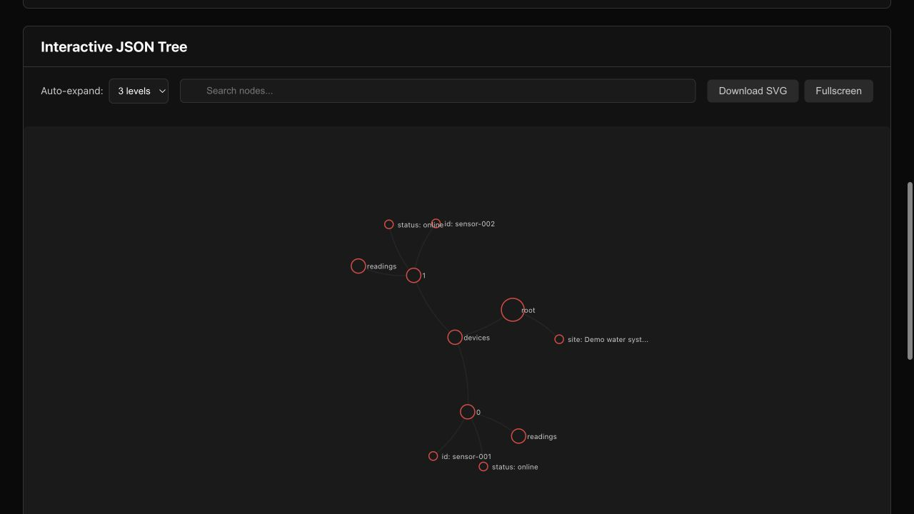

# Graph LM Pro visual demo

[Open the live app](https://graph-ui-project.vercel.app/) · [Try the comparison tool](https://graph-ui-project.vercel.app/compare)

Actual screenshots captured from the deployed app on September 30, 2026, using synthetic data. These are observed application results, not mockups.

## 1. Detect API changes

The comparison finds a number → string change in `device.flow_rate`, removal of `device.status`, addition of `device.battery`, and an updated schema version.

**Reproduce:** open Compare JSON and paste [Version A](version-a.json) and [Version B](version-b.json) into the two editors. The results update automatically.

## 2. Infer a schema and TypeScript interfaces

A synthetic payload with two water-sensor devices produces a schema, nested interfaces, object/array counts and quality checks.

## 3. Explore the JSON graph

The same payload is rendered as an interactive D3 tree. Expand nodes or change the depth to inspect nested fields.

**60-second walkthrough:** compare payloads → explain one breaking change → show generated types → expand the graph. This capture verifies those displayed features; AI analysis, performance and every export pathway were not tested in this session.
